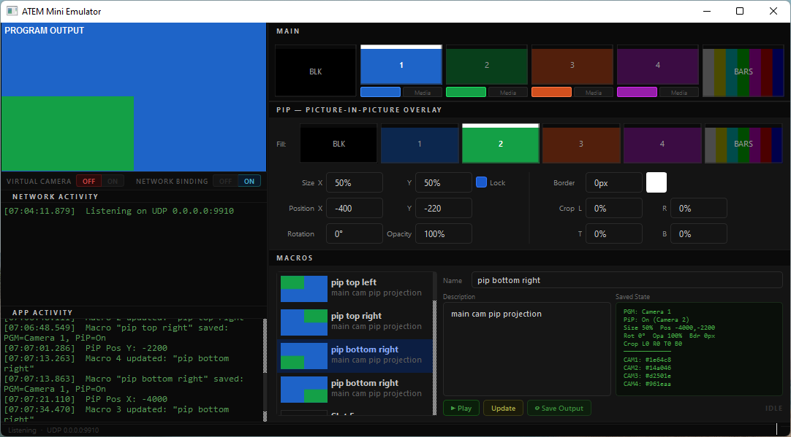

# ATEM Mini Emulator

A Windows desktop application that faithfully emulates a Blackmagic ATEM Mini
video switcher on UDP port 9910. Designed to be indistinguishable from real
hardware to the official BMDSwitcherAPI COM SDK and ATEM Software Control.

Use it to develop, test, and demonstrate ATEM-connected software — including
the companion [obs-atem](https://github.com/TBD) OBS Studio plugin — without
needing a physical switcher.

> **Guides:**
> [Tech stack, architecture & build →](docs/tech.md) · [Protocol capture & reverse engineering →](docs/capture.md)



---

## What it does

| Capability | Details |
| --- | --- |
| ATEM Mini protocol | Full UDP handshake, state dump, keepalive, command dispatch |
| Source switching | 6 sources: Black, Camera 1–4, Color Bars |
| Picture-in-Picture | DVE keyer: size, position, rotation, border, opacity, crop |
| Input sources | Per-input solid color, static image, or looping video file |
| Macro pool | 20 slots — create, run, delete; full state snapshot per macro |
| Live preview | 640×360 compositor at 30 fps (QPainter, no GPU required) |
| Virtual camera | DirectShow push-source DLL — appears as a webcam in OBS, Zoom, Camera app |
| Protocol log | Timestamped packet/command log in the GUI |
| Multi-client | Multiple SDK clients can connect simultaneously |

---

## Quick start

```powershell
# Build (Developer PowerShell for VS 2022)
cd D:\cemc-sr\atem-emulator
cmake -B build -G "Visual Studio 17 2022" -A x64 ^
    -DQt6_DIR="D:/ProgramFiles/Qt/6.11.0/msvc2022_64/lib/cmake/Qt6"
cmake --build build --config Release

# Run
build\Release\atem-emulator.exe
```

The emulator binds to **UDP 0.0.0.0:9910** on launch. See [tech.md](tech.md) for
full build requirements and steps.

---

## Connecting clients

### ATEM Software Control (official app)

1. Start `atem-emulator.exe`
2. Open ATEM Software Control
3. Switcher dropdown → **Manual…** → `127.0.0.1`

### BMDSwitcherAPI (C++ / COM SDK)

```cpp
IBMDSwitcherDiscovery* disc;
CoCreateInstance(CLSID_CBMDSwitcherDiscovery, nullptr, CLSCTX_ALL,
                 IID_IBMDSwitcherDiscovery, (void**)&disc);

BMDSwitcherConnectToFailure fail;
IBMDSwitcher* sw;
disc->ConnectTo(L"127.0.0.1", &sw, &fail);
```

### obs-atem plugin

In the OBS dock settings (⚙), set connection to **Manual IP** → `127.0.0.1`.
See [obs-atem](https://github.com/TBD) for installation instructions.

---

## Using the GUI

### Program bus

Six source buttons across the top. Click one to switch Program output.
The selected button shows a white bar across its top edge.

### Picture-in-Picture (DVE)

Enable the keyer checkbox, pick a Fill Source, and adjust the controls:

| Control | Range | Notes |
| --- | --- | --- |
| Size X / Size Y | 0–200% | Lock checkbox keeps X and Y equal |
| Position X / Y | –16000 to +16000 | Units: 1/1000 of frame width/height |
| Rotation | 0–359.99° | Stored as degrees × 100 |
| Border width | 0–50 px | At 1280-wide reference |
| Border color | ARGB picker | Click the color swatch |
| Opacity | 0–100% | |
| Crop L/R/T/B | 0–50% | Per edge |

All changes broadcast to connected clients in real time.

### Input sources

For each of the 4 camera inputs, choose:

- **Color** — solid ARGB fill (click the color swatch)
- **Photo** — static image file
- **Video** — looping `.mp4` / `.mov` / `.mkv` etc.

### Macros

Each macro slot stores a **state snapshot** (program source, full DVE state,
per-input source mode) plus an optional action sequence.

**Create:** Enter a name → **Save** to write the snapshot of the current state.

**Play:** Select a macro → **▶ Play** to restore its snapshot and run its actions.

**Action types:**

| Type | Effect |
| --- | --- |
| Switch Program | Sets program source |
| Keyer Enable | Enables DVE keyer |
| Delay | Pauses execution (ms) |

### Virtual camera

Click **Virtual Camera ON** to register `AtemVirtualCam.dll` as a DirectShow
capture device and begin streaming the live preview output. The device appears
as **"ATEM Mini Emulator"** in OBS, Zoom, the Windows Camera app, and any
DirectShow-compatible application. No external installs required — the DLL
self-registers under HKCU (no admin).

### Network binding

**Network ON/OFF** starts or stops the UDP server. The server runs on
`0.0.0.0:9910` and is started automatically on launch.

---

## Related projects

| Project | Role |
| --- | --- |
| [obs-atem](https://github.com/TBD) | OBS Studio C++ plugin — dockable macro trigger panel, connects to real ATEM hardware or this emulator |
| ATEM Software Control | Official Blackmagic app — connects to real hardware or this emulator |
| BMDSwitcherAPI SDK | Blackmagic COM SDK used by obs-atem and the capture tools |

---

## License

MIT — see [LICENSE](LICENSE).
