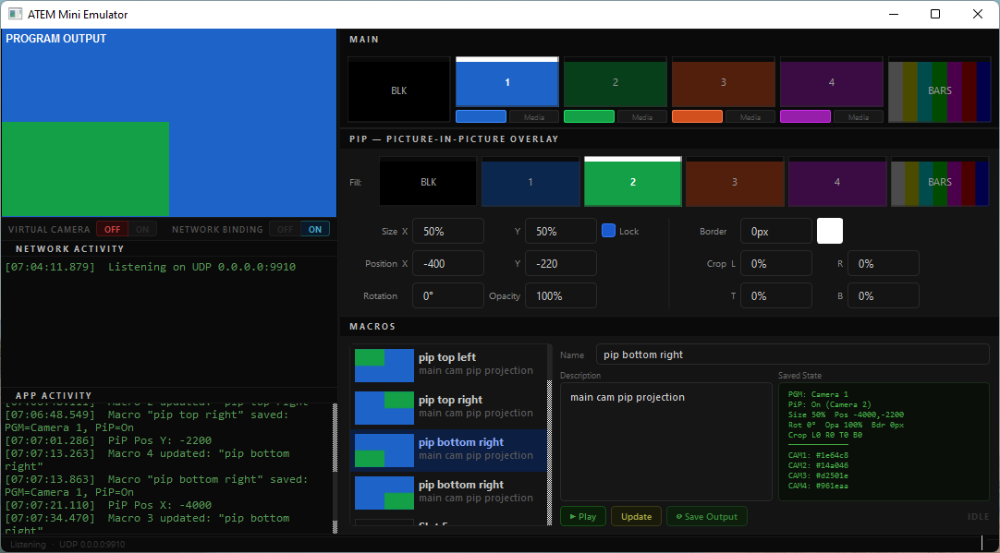

# ATEM Mini Emulator

A Windows desktop application that emulates a Blackmagic ATEM Mini video
switcher on UDP port 9910, for the official BMDSwitcherAPI COM SDK and ATEM
Software Control.

Use it to develop, test, and demonstrate ATEM-connected software — including
the companion [obs-atem](https://github.com/TBD) OBS Studio plugin — without
needing a physical switcher.

The switcher behind the window is the [emulator core](core): the state and
behaviour recorded from a real ATEM Mini with [atem-sweep](sweep). Against
that recording the emulator passes all 269 conformance tests, the same result
as the real device.

> **Guides:**
> [Emulator core →](core/README.md) · [atem-sweep: recording & conformance →](sweep/README.md) ·
> [Tech stack →](docs/tech.md) · [Protocol capture →](docs/capture.md)



---

## What it does

| Capability | Details |
| --- | --- |
| ATEM Mini protocol | The real device's handshake, connect dump (364 fields), acknowledgements and resends; 33 commands with the device's own checks, clamps and quirks |
| Source switching | Program bus: Black, Camera 1–4, Color Bars (plus the switcher's colour generators and media player inputs from clients) |
| Picture-in-Picture | Upstream key 1 as a DVE key, like the ATEM Mini: size, position, border, border colour, crop (DVE mask) |
| Transitions | Cut, auto transition, T-bar and fade to black run frame by frame (1080p24) |
| Input sources | Per-camera solid colour, static image, or looping video file |
| Macro pool | The switcher's 100 slots: record in ATEM Software Control or the SDK, or **Save Output** here; run with pauses, user waits and loop; rename; delete |
| Live preview | 640×360 compositor at 30 fps (QPainter, no GPU required) |
| Virtual camera | DirectShow push-source DLL — appears as a webcam in OBS, Zoom, Camera app |
| Protocol log | Connections and every command received, in the window |
| Multi-client | Several SDK clients at once; every change reaches all of them |

---

## Quick start

```powershell
# Build (Developer PowerShell for VS 2022). Qt needs the Multimedia module.
cd D:\cemc-sr\atem-emulator
cmake -B build-gui -G "Visual Studio 17 2022" -A x64 `
    -DQt6_DIR="D:/ProgramFiles/Qt/6.11.1/msvc2022_64/lib/cmake/Qt6"
cmake --build build-gui --config Release

# Run
build-gui\Release\atem-emulator.exe
```

The emulator listens on **UDP 0.0.0.0:9910** on launch. Options:

| Option | Meaning |
| --- | --- |
| `--listen ADDRESS` | Listen on one address only, e.g. `127.0.0.2` (lets atem-sweep's recording proxy use 127.0.0.1) |
| `--profile DIR` | Emulate another recorded switcher (default: `profiles/atem-mini_proto2.30`) |
| `--reference` | Start exactly as recorded — saved macros are not loaded or saved. For conformance checks: `atem-emulator --reference --listen 127.0.0.2`, then `atem-sweep 127.0.0.2 --verify sweep\golden\...\results.json` |

The build also produces `atem-emu.exe`, the same switcher without a window
(see [core/](core)).

---

## Connecting clients

### ATEM Software Control (official app)

1. Start `atem-emulator.exe`
2. Open ATEM Software Control
3. **File → Connection** → **Manual IP Address** `127.0.0.1` → **Connect**

Not yet verified end to end: its connection and use against the emulator are
the next step (see [sweep/README.md](sweep/README.md), `--capture`).

### BMDSwitcherAPI (C++ / COM SDK)

```cpp
IBMDSwitcherDiscovery* disc;
CoCreateInstance(__uuidof(CBMDSwitcherDiscovery), nullptr, CLSCTX_ALL,
                 __uuidof(IBMDSwitcherDiscovery), (void**)&disc);

BMDSwitcherConnectToFailure fail;
IBMDSwitcher* sw;
disc->ConnectTo(_bstr_t(L"127.0.0.1"), &sw, &fail);
```

### obs-atem plugin

In the panel settings (⚙), connect to **Manual IP** → `127.0.0.1`.

---

## Using the GUI

Everything in the window goes through the switcher's command handlers — the
same ones the SDK's commands use — so the window, ATEM Software Control, the
SDK and the OBS plugin always show the same state.

### Program bus

Six source buttons across the top. Click one to switch Program output.
The selected button shows a white bar across its top edge. Labels follow the
switcher's input names once they are renamed (e.g. in ATEM Software Control).

### Picture-in-Picture (DVE)

Click a **Fill** button to show that source as the PiP (the key becomes a DVE
key and goes on air); click the lit one again to take the PiP off air.

| Control | Range | Sent to the switcher as |
| --- | --- | --- |
| Size X / Size Y | 5–200% | DVE size 0.05–2.0 (Lock keeps X and Y equal) |
| Position X / Y | ±1600 / ±900 | DVE position ±16 / ±9 — the frame edges |
| Border width | 0–50 px | DVE border outer width 0–16, border on when > 0 |
| Border color | picker | DVE border hue / saturation / luma |
| Crop L/R/T/B | 0–50% | DVE mask (left/right of 32, top/bottom of 18), on while any edge > 0 |
| Rotation, Opacity | 0–359°, 0–100% | Not sent: an ATEM Mini can't rotate or fade a key; they only change the emulator's picture |

### Input sources

For each of the 4 camera inputs, choose:

- **Color** — solid fill (click the color swatch)
- **Photo** — static image file
- **Video** — looping `.mp4` / `.mov` / `.mkv` etc.

### Macros

The list is the switcher's macro pool (100 slots). Macros recorded in ATEM
Software Control or through the SDK appear here, and macros made here appear
there.

- **Save Output** stores the current picture in the selected slot as switcher
  commands (program, PiP source, DVE settings, PiP on/off), plus this
  emulator's camera pictures, size lock, rotation and opacity.
- **▶ Play** runs the selected macro (**■ Stop** while one runs).
- **Update** renames / re-describes the slot.
- **Saved State** lists the macro's steps.

Macros are saved in `%LOCALAPPDATA%\CEMC\ATEM Emulator\macros.json`. A file
from the earlier version (snapshots + actions) is converted on first start and
kept as `macros-v1.json`. Until something is saved there, the pool holds the
four macros recorded from the real ATEM Mini (left, right, test, pip).

### Virtual camera

Click **Virtual Camera ON** to register `AtemVirtualCam.dll` as a DirectShow
capture device and begin streaming the live preview output. The device appears
as **"ATEM Mini Emulator"** in OBS, Zoom, the Windows Camera app, and any
DirectShow-compatible application. No external installs required — the DLL
self-registers under HKCU (no admin).

### Network binding

**Network ON/OFF** starts or stops the UDP server. It starts automatically on
launch, on `0.0.0.0:9910` unless `--listen` says otherwise.

---

## Related projects

| Project | Role |
| --- | --- |
| [obs-atem](https://github.com/TBD) | OBS Studio C++ plugin — macro and PiP panels, connects to real ATEM hardware or this emulator |
| ATEM Software Control | Official Blackmagic app — connects to real hardware or this emulator |
| BMDSwitcherAPI SDK | Blackmagic COM SDK used by obs-atem and the capture tools |

---

## License

MIT — see [LICENSE](LICENSE).
