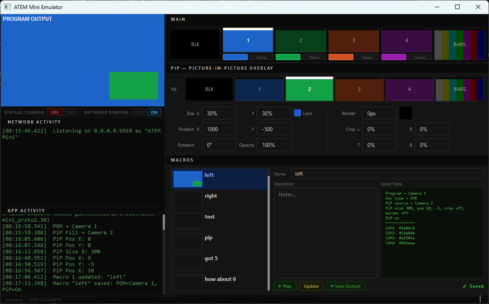
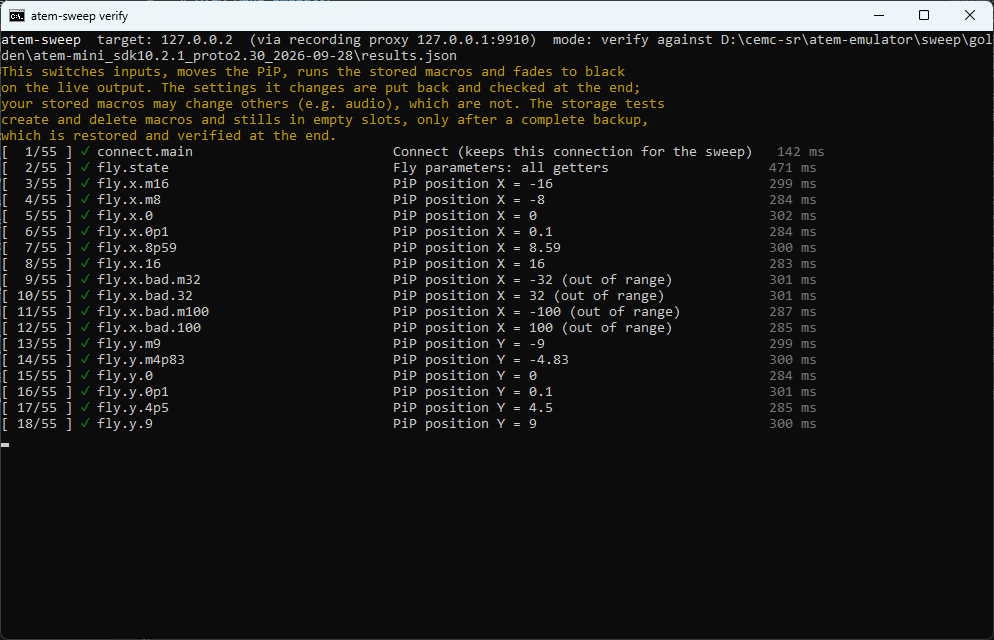
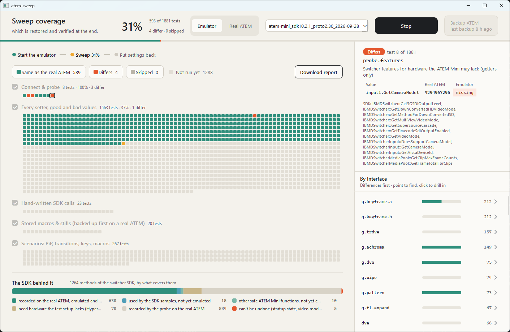

# ATEM Mini Emulator

A Windows desktop application that emulates a Blackmagic ATEM Mini video
switcher on UDP port 9910. Software that talks to an ATEM through
Blackmagic's switcher SDK (BMDSwitcherAPI) connects to it as if it were the
real device, so you can develop, test and demonstrate ATEM-connected software —
including the companion [obs-atem](https://github.com/tin921/obs-atem) OBS
Studio plugin — without a physical switcher.



---

## What it does

| Capability | Details |
| --- | --- |
| ATEM Mini protocol | The real device's handshake, its full startup state (364 fields), acknowledgements and resends, answers once per video frame; about 90 commands with the device's own checks, clamps and quirks, including macro and still transfers |
| Source switching | Program bus: Black, Camera 1–4, Color Bars (plus the colour generators and media player inputs from clients) |
| Picture-in-Picture | Upstream key 1 as a DVE key, like the ATEM Mini: size, position, border, border colour, crop |
| Transitions | Cut, auto transition, T-bar and fade to black run frame by frame (1080p24) |
| Input sources | Per camera: solid colour, still image or looping video file |
| Macro pool | The switcher's 100 slots: record in ATEM Software Control or through the SDK, or **Save Output** here; run with pauses, user waits and loop; rename; delete; upload and download |
| Live preview | 640×360 program picture at 30 fps (QPainter, no GPU) |
| Virtual camera | A DirectShow webcam — "ATEM Mini Emulator" in OBS, Zoom, the Camera app |
| Protocol log | Connections and every command received, in the window |
| Several clients | Every change reaches every connected client |

How faithful it is: the switcher behind the window was rebuilt from
recordings of a real ATEM Mini, and it is checked against them — 1,881 tests
of every safe SDK function the Mini has (see
[How it was built](#how-it-was-built)).

---

## Quick start

```powershell
# Build (Developer PowerShell for VS 2022). Qt needs the Multimedia module.
cd D:\cemc-sr\atem-emulator
cmake -B build-gui -G "Visual Studio 17 2022" -A x64 `
    -DQt6_DIR="D:/ProgramFiles/Qt/6.11.1/msvc2022_64/lib/cmake/Qt6"
cmake --build build-gui --config Release

# Run
build-gui\Release\atem-emulator.exe
```

It listens on **UDP 0.0.0.0:9910** at start. Options:

| Option | Meaning |
| --- | --- |
| `--listen ADDRESS` | Listen on one address only, e.g. `127.0.0.2` |
| `--profile DIR` | Emulate another recorded switcher (default `profiles/atem-mini_proto2.30`; also `atem-mini_proto2.30_2026-09-28`) |
| `--reference` | Start exactly as recorded: saved macros are not loaded or saved (for checks against the recordings) |

The build also makes `atem-emu.exe`, the same switcher without a window
([core/](core)). Build details: [docs/overview.md](docs/overview.md#build).

---

## Connecting clients

### obs-atem plugin

In the panel settings (⚙), connect to **Manual IP** → `127.0.0.1`.

### BMDSwitcherAPI (C++ / COM SDK)

```cpp
IBMDSwitcherDiscovery* disc;
CoCreateInstance(__uuidof(CBMDSwitcherDiscovery), nullptr, CLSCTX_ALL,
                 __uuidof(IBMDSwitcherDiscovery), (void**)&disc);

BMDSwitcherConnectToFailure fail;
IBMDSwitcher* sw;
disc->ConnectTo(_bstr_t(L"127.0.0.1"), &sw, &fail);
```

If nothing answers at the address, the SDK falls back to an ATEM on this PC's
USB: with a real ATEM plugged in, a wrong address connects to that instead.

### ATEM Software Control (official app)

**File → Connection → Manual IP Address** `127.0.0.1` → **Connect**. Not yet
verified end to end: the next step is to record what it sends (see
[Capturing another client](sweep/README.md#capturing-another-client)).

---

## Using the window

Everything in the window goes through the same command handlers as the
SDK's commands, so the window, SDK clients such as the OBS plugin and every
other connected client show the same state.

### Program bus

Six source buttons across the top; click one to switch Program. The selected
one has a white bar along its top edge. Labels follow the switcher's input
names when they are renamed (e.g. in ATEM Software Control).

### Picture-in-Picture (DVE)

Click a **Fill** button to show that source as the PiP (the key becomes a DVE
key and goes on air); click the lit one again to take the PiP off air.

| Control | Range | Sent to the switcher as |
| --- | --- | --- |
| Size X / Size Y | 5–200% | DVE size 0.05–2.0 (Lock keeps X and Y equal) |
| Position X / Y | ±20000 | DVE position in 100ths: ±1600 / ±900 are the frame edges; beyond that the PiP is (partly) off screen |
| Border width | 0–50 px | DVE border outer width 0–16, border on when > 0 |
| Border color | picker | DVE border hue / saturation / luma |
| Crop L/R/T/B | 0–50% | DVE mask (left/right of 32, top/bottom of 18), on while any edge > 0 |
| Rotation, Opacity | 0–359°, 0–100% | Not sent: an ATEM Mini can't rotate or fade a key; they only change the emulator's picture |

### Input sources

For each of the four cameras: **Color** (a solid fill; click the swatch),
**Photo** (a still image) or **Video** (a looping `.mp4` / `.mov` / `.mkv` …).

### Macros

The list is the switcher's macro pool (100 slots). Macros recorded in ATEM
Software Control or through the SDK appear here, and macros made here appear
there.

- **Save Output** stores the current picture in the selected slot as switcher
  commands (program, PiP source, DVE settings, PiP on/off), plus this
  emulator's camera pictures, size lock, rotation and opacity.
- **▶ Play** runs the selected macro (**■ Stop** while one runs).
- **Update** renames / re-describes the slot.
- **Saved State** lists the macro's steps.

Macros are saved in `%LOCALAPPDATA%\CEMC\ATEM Emulator\macros.json` (a file
from the earlier version is converted on first start and kept as
`macros-v1.json`). Until something is saved there, the pool holds the macros
recorded from the real ATEM Mini with the profile.

### Virtual camera

**Virtual Camera ON** registers `AtemVirtualCam.dll` (under HKCU, no admin)
and streams the program picture; it appears as **"ATEM Mini Emulator"** in
OBS, Zoom, the Windows Camera app and any DirectShow application.

### Network

**Network ON/OFF** starts or stops the UDP server. It starts at launch, on
`0.0.0.0:9910` unless `--listen` says otherwise.

---

## How it was built

Blackmagic publishes the SDK, not the network protocol underneath it, and no
emulator. So the emulator was rebuilt from recordings of the real switcher,
made with **[atem-sweep](sweep)**: a test client that drives the real ATEM
through the SDK — every safe function, good and bad input — with a
**recording proxy** in the middle that captures every packet both ways. The
same tests then run against the emulator, and each answer is compared with
the real device's.

```text
record:  atem-sweep ─► SDK ─► recording proxy ─► real ATEM Mini
verify:  atem-sweep ─► SDK ─► recording proxy ─► emulator
                              (every packet, both ways)
```

The sweep runs from the command line or its own window, which shows every
test as a square, coloured as it runs:





- **[sweep/README.md](sweep/README.md)** — the sweep, the proxy, recording
  safely (backups), the golden records, coverage, and the workflow from a
  recording to emulator code.
- **[core/README.md](core/README.md)** — the emulator core: protocol, state,
  command handlers, the rules the recordings showed, and its limits.
- **[docs/overview.md](docs/overview.md)** — how the pieces fit, the workflow,
  and how an AI coding agent turns the recordings into emulator code.

---

## Repository

| Folder | What |
| --- | --- |
| [src/](src) | The emulator app: window, picture, virtual camera ([docs/overview.md](docs/overview.md#the-apps-architecture)) |
| [core/](core) | The switcher itself, shared by the app and `atem-emu.exe` |
| [sweep/](sweep) | atem-sweep and atem-sweep-gui: record the real ATEM, verify the emulator |

## Related projects

| Project | Role |
| --- | --- |
| [obs-atem](https://github.com/tin921/obs-atem) | OBS Studio plugin — macro, PiP and Views panels; connects to a real ATEM or this emulator |
| ATEM Software Control | Blackmagic's app; with this emulator not yet verified |
| BMDSwitcherAPI SDK | Blackmagic's COM SDK, used by obs-atem and atem-sweep |

## License

MIT — see [LICENSE](LICENSE).
